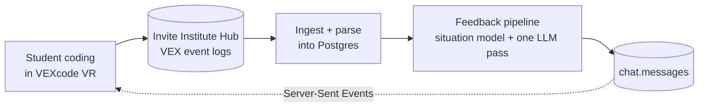

# VEX Pedagogical Agent

A pedagogical AI agent for **VEXcode VR**, the block-based tool middle schoolers use to
drive a virtual robot. It watches how a student's code changes as they work, builds a
grounded picture of what they are actually doing, and gives short, kind, specific
feedback - both when a student asks and, on its own, when a student looks stuck.



> Full documentation is published at <https://inviteinstitute.github.io/vex-agent-integration/>
> (or run `mkdocs serve` to read it locally on port 4100).

## Quick Start (single-container dev)

This branch bundles everything - Postgres, the API, and the client - into **one
container**, so setup is a single command with nothing to wire. All you need is
**Docker** (Compose v2) and [Ollama](https://ollama.com) on your Mac for the LLM.

```bash
# one time: the model the agent calls, served locally by Ollama
brew install ollama && ollama pull gpt-oss-20b   # the Ollama.app runs `ollama serve` for you

cp .env.example .env     # ready to run as-is; nothing to edit
docker compose up        # first run builds the image, then seeds the database
```

Open the UI at <http://localhost:5173> (use `localhost`, which the Vite dev server
allows). The API is on <http://127.0.0.1:8001>, and Postgres is exposed on
`127.0.0.1:5433` if you want to inspect it directly.

On first boot the container initializes Postgres, applies every migration, and loads
the bundled VEX fixtures automatically, so there is real telemetry to ground on with
**no manual steps**. The data lives in the `pgdata` volume and survives restarts; run
`docker compose down -v` to wipe and reseed from scratch.

This all-in-one container is a local-dev convenience and is intentionally **not** how
production runs - prod keeps Postgres, the API, and an nginx-served static client
separate (see [Serving It Remotely](#serving-it-remotely)). Your day-to-day changes
live in `client/` and `server/vex_agent/`, which are the same files in both, so they
port straight back to `main`.

### Verifying it works

After `docker compose up`, the logs show `[entrypoint] Database ready.` and then all
three processes starting. To confirm the stack end to end:

```bash
curl http://127.0.0.1:8001/healthz          # the API is up
```

1. Open <http://localhost:5173> - the chat UI loads and its first `/v1` call succeeds
   with no Turnstile screen.
2. Edit a file under `client/src/` and the browser hot-reloads. Edit one under
   `server/vex_agent/` and uvicorn reloads.
3. Send a chat message and you get a grounded reply built from the seeded telemetry.
   That is the real round trip out to Ollama running on your Mac.

Rebuild the image after changing the `Dockerfile` or dependencies with
`docker compose up --build`.

### Caveats

Both are Docker-on-Mac quirks rather than anything about the setup itself:

- **The agent cannot reach Ollama.** Ollama defaults to listening on `127.0.0.1`, which
  the container cannot always reach through `host.docker.internal`. On the host, run
  `launchctl setenv OLLAMA_HOST 0.0.0.0` and restart Ollama.
- **Hot reload feels sluggish.** File watching over Docker-Mac bind mounts is sometimes
  slow to notice a change. A `docker compose restart` clears it.

## What You Get

The agent talks to a student in two ways, and **both run the same feedback code**, so the
pedagogy is identical on either path:

- **Reactive** - a student types a question or taps Help. The agent grounds the reply in
  their current program and answers.
- **Proactive** - a background daemon watches the event stream, measures how each run
  differs from the last, and detects behaviors (wheel-spinning, resilience, exploring,
  step-by-step, going idle). When one fires it pushes a short note without being asked.

Under both is one deterministic **situation model** - a plain-language read of the session
built from telemetry, not guessed by the model - plus a single LLM pass. The trigger
engine is vendored from [lm-dashboard](https://github.com/InviteInstitute/lm-dashboard) so
the agent's read of a student stays comparable to the researcher dashboard's.

## Layout

| Path | What |
|---|---|
| `server/vex_agent/` | the FastAPI backend, in layers (`api`, `services`, `domain`, `data`, `ingest`, `triggers`) |
| `server/db/migrations/` | the schema, as ordered idempotent SQL - the source of truth |
| `client/` | the React (Vite) chat client |
| `docs/` | the Material for MkDocs site |

## Serving It Remotely

Production runs the same `compose.yml` (Postgres + the API, with the proactive daemon
in-process). The API binds to `127.0.0.1:8001` so **nginx** sits in front of it, serving
the built client from `client/dist` and proxying `/v1`, `/admin`, and `/healthz`.
`make deploy` is the whole rollout: `scripts/deploy.sh` guards a dirty tree, pulls, rolls
the stack, applies the migrations, and gates on `/healthz`, then the client is rebuilt.
See the
[Deployment](https://inviteinstitute.github.io/vex-agent-integration/guides/deployment/)
docs.

## Under the Hood

Ingestion pulls VEX logs from the Hub incrementally (a cursor in Postgres, idempotent
inserts) and parses them into `parsed_events`. The proactive daemon assumes a **single
writer** and is the sole owner of that cursor. The full write-up - architecture, the
feedback pipeline, proactive triggers, the data model, configuration, and the API - lives
at <https://inviteinstitute.github.io/vex-agent-integration/>.
