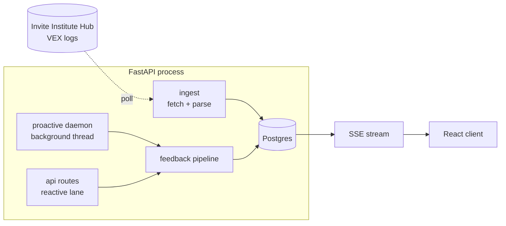

# Architecture

The agent is a single FastAPI backend, a Postgres store, and a small React client. It
reads VEX events, grounds a reply in what a student is actually doing, and delivers that
reply over a live stream. The design has two ideas at its core. Feedback flows through
**one shared pipeline** no matter who started it, and the code is split into **layers**
that each depend inward, never outward.

## Two Lanes, One Pipeline

A student can be helped two ways, and both run the exact same feedback code.

- **Reactive.** A student types a message or taps the help button. An API route grounds
  the reply and answers.
- **Proactive.** A background daemon watches the event stream, measures how each run of
  code differs from the last, and detects behaviors worth a nudge. When one fires it
  pushes a short note on its own.

These used to be two hand-copied sequences that drifted apart. They are now the single
function in `services/feedback.py`, so a proactive nudge and a typed answer share the
same grounding, the same model call, and the same pedagogy. The only difference is the
input. See the [feedback pipeline](feedback-pipeline.md) for the step-by-step.

## The Layers

The backend package is `server/vex_agent`, organized so each layer only reaches inward.

| Layer | Package | Holds |
|---|---|---|
| API | `api/` | FastAPI routers for students, the SSE stream, admin, and system, plus the Turnstile bot gate |
| Services | `services/` | orchestration, the shared feedback pipeline, the proactive daemon, sessions, identity, and log sync |
| Domain | `domain/` | pure pedagogy with no framework or database, the situation model, the prompt, the feedback policy, and per-playground grounding |
| Data | `data/` | Postgres access |
| Ingest | `ingest/` | fetch VEX logs from the Hub and parse them into rows |
| LLM | `llm/` | the OpenAI-compatible client and the response sanitizer |
| Triggers | `triggers/` | the vendored behavior engine, edit distance, detectors, and episodes |

The `domain/` layer is the valuable part to keep clean. It has no imports from FastAPI or
psycopg, so the rules for what the agent says can be read and tested on their own.

## The Trigger Engine Is Vendored

Everything under `triggers/` is copied from
[lm-dashboard](https://github.com/InviteInstitute/lm-dashboard) and kept in sync on
purpose. The dashboard is where researchers watch these same behaviors, so sharing the
engine keeps the agent's read of a student comparable to the numbers on the board. The
coupling points one way. The app adapts its event stream to the engine in
`services/proactive.py`, and the engine itself stays free of any framework or database.

## Processes And Topology

Compose runs two containers, connected through Postgres.

| Service | Command | Role |
|---|---|---|
| `api` | `uvicorn vex_agent.app:app` | serves the reactive routes and the SSE stream, and hosts the proactive daemon as a background thread |
| `db` | `postgres` | the store, and the seam between writing and reading |

The proactive daemon is not its own container. It starts inside the API process on
startup and stays off unless `TRIGGER_DAEMON_ENABLED` is set. It runs in a thread rather
than an asyncio task because its database, HTTP, and model calls are blocking and would
otherwise stall the event loop. Because it keeps a cursor and dedupes each trigger, it
assumes exactly one instance is running.

## Grounding Is Deterministic

The agent never asks the model what the robot did. It builds a **situation model** from
the telemetry itself, a plain-language summary computed in `domain/context_builder.py`,
and hands that to the one feedback call. A single LLM pass, grounded on measured facts
and the student's real program, means there is no second paraphrase step that can drift
into a confident wrong story. This is the lesson the early spike taught, and it is why
the pipeline looks the way it does.
