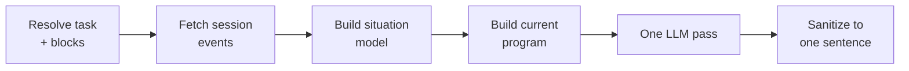

# Feedback Pipeline

Every reply the agent gives runs through one function, `generate_feedback` in
`services/feedback.py`. A student who types a question and a daemon that fires a trigger
both land here, so the pedagogy is identical either way. This page walks the steps and
then shows what changes between the two lanes.

## The Steps

1. **Resolve the task and blocks.** Given the playground the student is in, look up the
   task description and the list of blocks available for it (`domain/catalogs.py`).
   Unknown playgrounds fall back to a default.
2. **Fetch the session events.** Read the parsed VEX events for this student and session.
   The reactive lane already has them and passes them in to skip a second read.
3. **Build the situation model.** Turn the telemetry into a plain-language read of what
   is happening, computed deterministically in `domain/context_builder.py`. This is the
   grounding, and it is measured, not guessed.
4. **Build the current program.** Render the student's live workspace as readable
   pseudo-code, marking which blocks are `[Active]` and which are `[Orphaned]`
   (`triggers/smart_delta.py`). This replaced dumping raw logs at the model, which was
   the source of early hallucinations.
5. **Run one LLM pass.** Hand the model the task, the available blocks, the current
   program, the situation model, the recent chat, and the feedback classes, and get back
   one short reply (`llm/client.py`).
6. **Sanitize.** Trim to a single sentence and strip the label and quote leaks that small
   local models tend to emit (`llm/sanitizer.py`).

## One Model Call, Grounded On Facts

The important choice here is what the pipeline does **not** do. It does not make a first
call to ask the model what the robot did and then a second call to write feedback about
it. That two-step shape is where a model invents a tidy story that never happened. Here
the grounding is a deterministic situation model over real events, and there is exactly
one model call on top of it. No raw logs, no paraphrase in the loop, nothing that can
quietly drift.

## What Differs Between The Lanes

The steps are the same. Only the inputs change.

| Input | Reactive | Proactive |
|---|---|---|
| `student_message` | the student's real message | empty, there is no student turn |
| `behavior_fact` | none | a neutral fact about the behavior that fired |
| `feedback_classes` | decided from the session snapshot | decided from the trigger |

The `behavior_fact` is worth calling out. When a trigger fires, the pipeline appends a
**neutral, measured statement** of what happened to the situation model, never the
internal trigger label. The model is told something like the student re-ran the same code
several times, not the word wheel-spinning. A label-only prompt hallucinated in early
testing, so the design feeds facts and lets the reply stay grounded.

## Where It Goes

The generated reply is saved to `chat.messages` and delivered to the browser over
Server-Sent Events. Proactive replies are saved with `origin = 'proactive'` so they can
be told apart from answers to a typed question, though the text itself came through the
same pipeline. For the behaviors that start a proactive reply, see
[proactive triggers](proactive-triggers.md).
