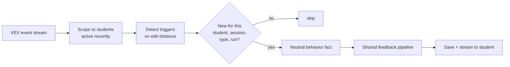

# Proactive Triggers

The agent can reach out on its own. A background daemon watches the VEX event stream,
measures how a student's code changes from one run to the next, and detects a handful of
behaviors worth a nudge. When one fires, the daemon runs it through the shared
[feedback pipeline](feedback-pipeline.md) and pushes a short message without waiting to
be asked.

The whole engine under `triggers/` is vendored from
[lm-dashboard](https://github.com/InviteInstitute/lm-dashboard) so the agent's read of a
student matches the researcher board.

## Edit Distance Is The Signal

Every trigger is defined on one number, the **edit distance** between a student's current
program and their previous one. The engine parses each Blockly workspace into a tree and
runs APTED tree-edit distance over the two trees (`triggers/distance.py` and
`triggers/ast_builder.py`). Synthetic connector nodes cost nothing to add or remove, so
adding one real block scores 1 rather than 2.

- **0** means they re-ran the same code.
- **small** means a tweak.
- **large** means a rewrite.

## The Five Triggers

Each threshold below is measured on that per-run edit distance
(`triggers/constants.py`).

| Trigger | Label | Fires when |
|---|---|---|
| `wheel_spin` | Wheel-spinning | 6 or more consecutive zero-edit runs |
| `resilience` | Resilience | a real edit lands after 4 or more zero-edit runs |
| `explorer` | Explorer | a single run changes by 13 or more |
| `iterative` | Step-by-Step | enough runs with any real edit pile up, default 6, tuned per playground |
| `inactive` | Inactive | idle for more than 240 seconds |

An idle student is re-alerted after 600 seconds so someone who stays stuck resurfaces
instead of being nudged once and forgotten. Step-by-Step counts any run with an edit
distance above zero, and its threshold is per playground, with `CoralReefRescue` and
`RoverRescue` set lower than the default.

## Episodes Give The Triggers Context

Before the triggers run, the engine segments the raw event stream into **episodes**,
CODE, RUN, and RESET, with pauses called out as `INACTIVE_PAUSE` and `POST_RUN_PAUSE`
(`triggers/episode_engine/`). Hard-boundary episodes never merge across a gap, and small
UI-only events fold into whatever surrounds them. This segmentation is what lets the
agent tell steady building apart from stalling, and it feeds the grounding the model
sees.

## From Trigger To Nudge



- **Scope.** Each tick looks only at students with telemetry in the recent window, set by
  `TRIGGER_STUDENT_RECENCY_HOURS` and defaulting to 24.
- **Fire once.** A given trigger for a given student, session, type, and run fires a
  single time. A student only hears from the agent again when genuinely new behavior
  trips something, which the `agent_triggers` unique key enforces.
- **Neutral facts, never labels.** The pipeline is handed a measured statement of what
  happened, not the word wheel-spinning. Feeding the label alone hallucinated in early
  testing. See the [feedback pipeline](feedback-pipeline.md#one-model-call-grounded-on-facts).
- **Delivery.** The message is saved to `chat.messages` with `origin = 'proactive'` and
  streamed to the browser.

## Turning It On

The daemon is off by default. In the repo-root `.env`, set the flag and a poll interval.

```bash
TRIGGER_DAEMON_ENABLED=true
TRIGGER_POLL_INTERVAL_S=5
```

Its scope is every student with telemetry, so once on it messages real students. To try
a single pass by hand without the timer, POST to the admin tick. Every flag, including
the `TRIGGER_DISABLED` detect-but-do-not-act toggle, is in
[Configuration](../guides/configuration.md).
