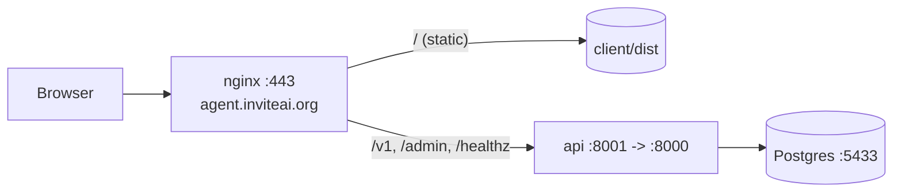

# Deployment

Production runs the same `compose.yml` as local dev, minus the dev-only overlay. The
stack is two services — **`db`** (Postgres) and **`api`** (FastAPI, with the proactive
daemon running in-process). The React client is a static build served by **nginx**, not
by the API.



## One-Command Deploy

`scripts/deploy.sh` is the whole backend rollout. It refuses to run over a dirty tree,
does a fast-forward pull, rebuilds and rolls the stack, applies the migrations, and gates
on the health check.

```bash
make deploy      # or: scripts/deploy.sh && npm --prefix client run build
```

`make deploy` runs the script and then rebuilds the client, since nginx serves the client
from `client/dist` rather than the API (see [The Client Build](#the-client-build)). Under
the hood the script does, in order:

1. Aborts if there are uncommitted changes to tracked files, so a pull never clobbers edits.
2. `git pull --ff-only`.
3. `docker compose -f compose.yml up -d --build` (rolls `db` + `api`).
4. Applies every `server/db/migrations/*.sql` (all idempotent — see below).
5. Polls `http://127.0.0.1:8001/healthz` and exits non-zero if it isn't `200`.

!!! note "The daemon rolls with the API"
    The proactive daemon runs inside the `api` container (gated by
    `TRIGGER_DAEMON_ENABLED`), so there's no separate service to deploy. Run exactly one
    `api` instance — the daemon assumes a single writer.

## Migrations

The SQL files under `server/db/migrations/` are the source of truth for the schema — the
API does **not** build it on startup. Every file is idempotent (`CREATE ... IF NOT
EXISTS`, guarded constraints), so re-running the whole loop is safe. `deploy.sh` runs it
for you; to apply by hand against a running DB:

```bash
for f in server/db/migrations/*.sql; do
  docker compose -f compose.yml exec -T db \
    psql -U vexagent -d vexagent -v ON_ERROR_STOP=1 < "$f"
done
```

## The Client Build

The client is a Vite build that nginx serves from `client/dist`. `deploy.sh` does not
rebuild it — do that when the frontend changes:

```bash
npm --prefix client run build   # -> client/dist
```

The production build reads `client/.env.production`, which pins `VITE_API_BASE_URL` to
`https://agent.inviteai.org/v1`.

## The nginx Front

nginx terminates TLS and splits traffic: the static SPA at `/`, and the API for the
proxied paths.

```nginx
server {
    server_name agent.inviteai.org;
    root /var/www/vex-agent-integration/client/dist;

    location /v1/     { proxy_pass http://127.0.0.1:8001; }   # student + stream API (bot-gated)
    location /admin/  { proxy_pass http://127.0.0.1:8001; }   # admin tick
    location = /healthz { proxy_pass http://127.0.0.1:8001; } # health check
    location /        { try_files $uri /index.html; }         # the SPA
}
```

!!! warning "Health path"
    The health check is `/healthz`. If you point an external uptime monitor at it, use
    that exact path — an unknown path under `/` falls through to the SPA and returns the
    HTML index with a `200`.

## Health Check

```bash
curl -s http://127.0.0.1:8001/healthz
# {"status":"ok"}
```

`deploy.sh` waits on this before declaring success, so a broken roll fails loudly
instead of silently serving a dead API.
