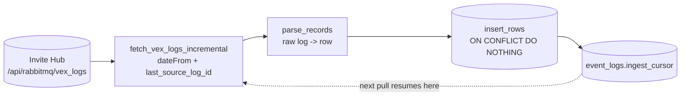

# Ingestion

Everything the agent knows about a student starts as a VEX event in the **Invite
Institute Hub**. Ingestion pulls those events, parses them into `event_logs.parsed_events`,
and advances a cursor so the next pull reads only what's new.



## Incremental By Cursor

The sync is bounded by **recency, not history**. Each pull sends the Hub a server-side
`dateFrom` filter (rewound a couple of seconds so a boundary event is never missed) plus
the last `source_log_id` it stored, so it reads only events at or after where it left
off. A quiet gap of days is still just a couple of pages. The walk never grows with the
size of the dataset.

The cursor lives in Postgres, in **`event_logs.ingest_cursor`** - one row, holding the
newest `source_log_id` and event timestamp seen. It replaced an older bind-mounted JSON
file whose path could drift from the code. Because it's a DB row it can't diverge from a
container mount, and it's seeded directly from the newest event already in
`parsed_events`, so a fresh deploy resumes incrementally instead of re-draining history.

!!! info "Forward-only"
    The cursor is advanced with a forward-only guard: a stale or out-of-order writer can
    never move it backward.

## Idempotent Inserts

`parsed_events` has a `UNIQUE(source_log_id)` constraint, and `insert_rows` uses
`ON CONFLICT (source_log_id) DO NOTHING`. Re-fetching an event the store already has is a
**no-op**, not a duplicate. This is what makes the overlap window safe, and what lets a
per-student freshness fetch run without corrupting anything.

## Who Syncs

Three callers pull logs, but they split cleanly into cursor owners and cursor-neutral
readers:

| Caller | Scope | Advances the cursor? |
|---|---|---|
| Proactive daemon (each tick) | all students | **yes** |
| Boot warm-up (once at startup) | all students | **yes** |
| Request path (a student asks for help) | that student only | **no** (`advance_cursor=False`) |

Only **full-catalog** syncs advance the global cursor. A per-student freshness fetch
pulls that one student's newest events so feedback is in-the-moment, but must not move
the global cursor - that would skip other students' unsynced rows. Idempotency makes its
re-fetch harmless.

## From The Command Line

Two console scripts ship with the `vex_agent` package (after `pip install -e .`).

**Parse a log file into the database.** Reads an `.ndjson` / `.json` export and, with
`--insert`, writes rows to `parsed_events`. This is how the bundled fixtures load.

```bash
vex-parse-logs --input server/tests/fixtures/raw_logs/01_error_flagging_a.ndjson --insert
```

**Fetch from the Hub directly.** Pulls live logs. `--incremental` uses a `--state-file`
cursor and `--insert` writes them to Postgres. Handy for a manual backfill.

```bash
vex-fetch-logs --incremental --insert --state-file /tmp/vex_cursor.json
```

!!! note "The CLI keeps its own cursor"
    `vex-fetch-logs` tracks its `--state-file` independently of the service's DB cursor.
    It's a manual escape hatch. The running service always uses `event_logs.ingest_cursor`.
    Because inserts are idempotent, a manual CLI run can never create duplicates.

See [Data model](../concepts/data-model.md) for the shape of `parsed_events` and the rest
of the schema.
