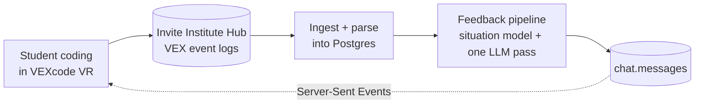
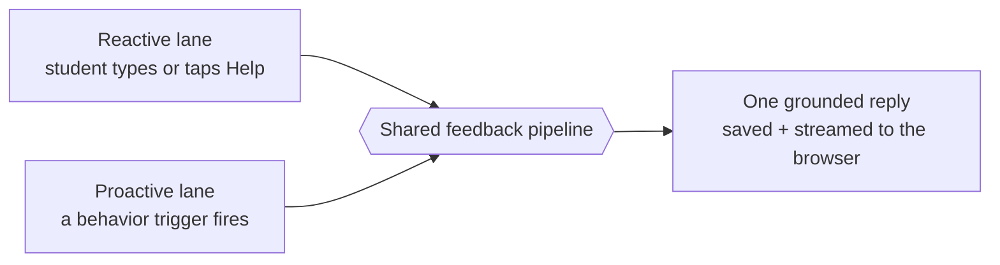

# VEX Pedagogical Agent

This is a pedagogical AI agent for VEXcode VR, the block-based programming tool that
middle schoolers use to drive a virtual robot. It watches how a student's code changes
as they work, builds a grounded picture of what they are actually doing, and gives them
short, kind, specific feedback. It answers when a student asks, and it also reaches out
on its own when a student looks stuck.

## How It Works, In One Paragraph

A student writes and runs block code in VEXcode VR, and each action lands as an event in
the Invite Institute Hub. The agent pulls those events, parses them into Postgres, and
turns them into a **deterministic situation model**, a plain-language read of the session
built from the telemetry rather than a guess from the model. When feedback is needed the
agent hands that situation, the student's current program, and the recent chat to a
single LLM pass, and the reply comes back grounded in what really happened. Every reply,
whether the student asked for it or the agent offered it, goes through the **same
pipeline**, so the pedagogy is identical on both paths.

## Two Lanes, One Pipeline

The agent talks to a student in two ways, and both run the same feedback code.

- **Reactive.** A student types a question or taps the help button. The agent grounds the
  reply in their current code and answers.
- **Proactive.** A background daemon watches the event stream, measures how each run of
  code differs from the last, and detects behaviors like wheel-spinning, resilience,
  exploring, step-by-step building, and going idle. When one fires it pushes a short note
  without waiting to be asked.

The trigger engine is vendored from
[lm-dashboard](https://github.com/InviteInstitute/lm-dashboard) so the agent's read of a
student stays comparable to the researcher dashboard's.

## What You Get

The backend is one FastAPI service laid out in clean layers, a Postgres store, and a
small React client. Feedback runs through UIUC servers in production or a
local Ollama in development, and nothing about the pedagogy changes when you swap them.

## Where To Go Next

-   :material-rocket-launch:{ .lg .middle } **[Quickstart](quickstart.md)**

    ---

    Bring up Postgres and the API with compose, load a session, and run one feedback tick.

-   :material-sitemap:{ .lg .middle } **[Architecture](concepts/architecture.md)**

    ---

    The layered backend, the two lanes, and the one shared pipeline underneath them.

-   :material-message-reply-text:{ .lg .middle } **[Feedback pipeline](concepts/feedback-pipeline.md)**

    ---

    How a situation model plus a single LLM pass produces one grounded reply.

-   :material-code-tags:{ .lg .middle } **[API reference](reference/api.md)**

    ---

    Every endpoint the API exposes, with request and response shapes.

